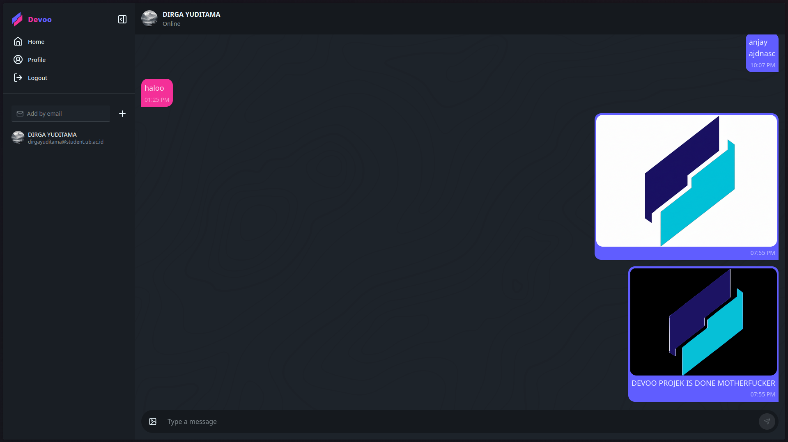

<div>
  
  
</div>

# Devoo Chat App 🔥

A modern, real-time chat application built with **React**, **TypeScript**, and **Firebase**.

## ✨ Features

- 🔐 **Authentication** - Email/Password login & registration
- 💬 **Real-time messaging** - Instant message updates with Firestore
- 🖼️ **Image sharing** - Upload and share images in chats
- 👤 **User profiles** - Customizable profile pictures
- 📇 **Contact management** - Add contacts by email, only see your contacts in the sidebar
- 🎨 **Theme system** - Switch between beautiful themes, persisted with Zustand
- 🪩 **Custom logo** - Consistent SVG logo across the app
- 🔔 **Toast notifications** - User feedback for actions and errors
- 📱 **Responsive** - Works on desktop and mobile

## 🛠️ Tech Stack

  

- **Frontend Framework**:  + 
- **State Management**: 
- **Styling**:  + 
- **Backend/Database**: 
  - Authentication
  - Firestore Database
  - Cloud Storage
- **Build Tool**: 
- **Routing**: 

## 🚀 Quick Start

### Prerequisites

- Node.js 18+ installed
- Firebase account (free tier is fine)

### 1. Clone & Install

```bash
git clone https://github.com/dirgaydtm/Devoo-App.git
cd Devoo-App
npm install
```

### 2. Configure Environment Variables

```bash
# Copy .env.example to .env
cp .env.example .env
```

Edit `.env` and add your Firebase config:

```env
VITE_FIREBASE_API_KEY=your_api_key_here
VITE_FIREBASE_AUTH_DOMAIN=your_project.firebaseapp.com
VITE_FIREBASE_PROJECT_ID=your_project_id
VITE_FIREBASE_STORAGE_BUCKET=your_project.appspot.com
VITE_FIREBASE_MESSAGING_SENDER_ID=your_sender_id
VITE_FIREBASE_APP_ID=your_app_id
```

### 3. Run Development Server

```bash
npm run dev
```

Open [http://localhost:5173](http://localhost:5173) 🎉

## 📁 Project Structure

```
Devoo-App/
├── src/
│   ├── components/       # Reusable UI components (Sidebar, Logo, AddContactForm, etc.)
│   ├── constants/        # App-wide constants (themes, etc.)
│   ├── hooks/            # Custom React hooks (e.g. useImageInput, useAuthListener)
│   ├── layout/           # Layout components (Navbar, etc.)
│   ├── pages/            # Page components (Auth, Home, Profile, etc.)
│   ├── store/            # Zustand state management (auth, chat, contact, theme)
│   ├── types/            # TypeScript type definitions (e.g. express.d.ts, global types)
│   ├── utils/            # Utility functions (validation, helpers)
│   ├── lib/              # External libraries & configurations (firebase, axios)
│   ├── index.css         # Global styles (Tailwind, DaisyUI, custom)
│   └── App.tsx           # Main app component
```

## 📄 License

MIT License - feel free to use this project for learning or your own applications!

## 👨‍💻 Author

**Dirga Yuditama**
- GitHub: [@dirgaydtm](https://github.com/dirgaydtm)

